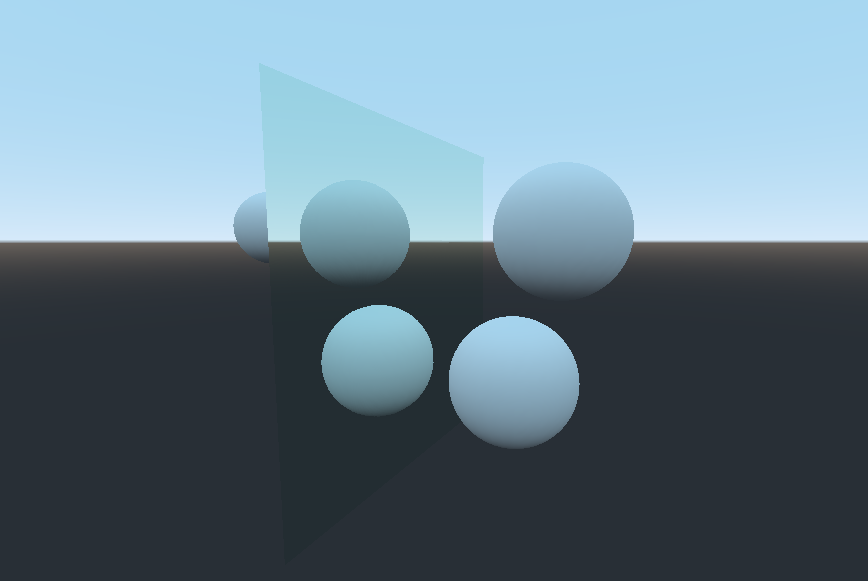

# Godot Mirror



This version is compatible with Godot 4.0.1.


## Project overview

Sacred Fruit is a custom Godot 4.0 game framework built around Quake-style map entities.
Features include a flexible I/O dispatch system, PS1 visual shader, and portal/mirror rendering.
Refer to `docs/README.md` for detailed developer documentation, `docs/STYLE.md` for coding
standards, and `docs/TESTS.md` for running the built-in smoke tests.

Run `scripts/format_and_lint.sh` before committing code to apply standard formatting.

You can adjust the active build profile (fast-iteration/playtest/shipping) by
editing `project.godot` or using the provided script:

```sh
./scripts/build_profile.sh playtest
```

The current profile is read at startup by `GameManager`.


A plugin created for godot to instance mirrors in a 3D scene. The mirrors use additional cameras to render the scene from a mirrored perspective.

Mirror properties that can be adjusted:
 - Tint
 - Size
 - Visible visual layers
 - Player camera
 - Distortion

 ## Usage

 After the addon is enabled a custom node is added to godot under the spatial node. 

 The main camera that renders the scene needs to be selected in the variables of the node. Only one camera is supported at a time. The plugin adds a secondary camera to the opposite side of the mirror relative to this camera and renders the image to the mirror surface.

 The cull mask array contains the visual layers which are NOT rendered. The render layers numbering is different from their indexing. To avoid rendering layer 1 add a 0 element to the list.
 To avoid rendering layer 2 add a 1 element to the list and so on.

 ## Installation

 Copy the addons/Mirror folder into your godot root directory, same as the asset library installs addons. Enable the plugin in Project settings/Plugins.

 ## Limitations

 Multiple mirrors do not work properly if you can see one mirror in the reflection of the other mirror.
